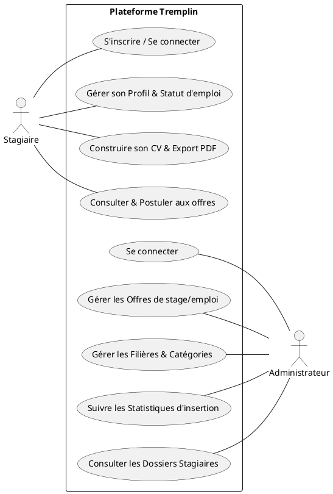
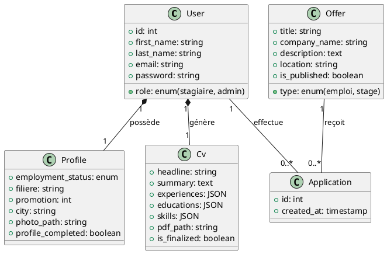
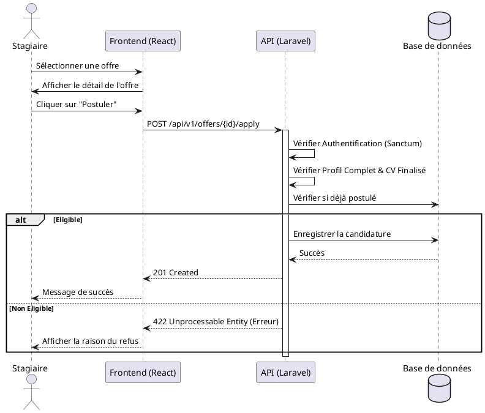

# RAPPORT DE PROJET DE FIN DE STAGE

**Thème :** Conception et Réalisation d'une Plateforme de Gestion des Stagiaires et de Suivi d'Insertion Professionnelle
**Nom du Projet :** Tremplin
**Organisme d'accueil :** ISTA Khemisset

---

## SOMMAIRE

1. [Remerciements](#1-remerciements)
2. [Introduction Générale](#2-introduction-générale)
3. [Présentation de l'Organisme](#3-présentation-de-lorganisme)
4. [Analyse du Projet](#4-analyse-du-projet)
    * 4.1 Problématique
    * 4.2 Solution proposée
    * 4.3 Analyse des besoins
5. [Conception](#5-conception)
    * 5.1 Diagramme de Cas d'Utilisation
    * 5.2 Diagramme de Classes
    * 5.3 Diagramme de Séquence
6. [Réalisation Technique](#6-réalisation-technique)
    * 6.1 Environnement de travail
    * 6.2 Architecture logicielle
    * 6.3 Aperçu de l'application
7. [Conclusion Générale](#7-conclusion-générale)

---

## 1. REMERCIEMENTS

Nous tenons à exprimer notre profonde gratitude à toutes les personnes qui ont contribué au succès de ce projet de stage.

Tout d’abord, nous remercions la direction et le corps enseignant de l’**ISTA Khemisset** pour leur soutien académique et pour nous avoir fourni les bases nécessaires à la réalisation de ce travail.

Nous adressons nos plus sincères remerciements à notre encadrant de stage pour ses précieux conseils, sa disponibilité et son partage d'expertise technique qui nous ont permis de surmonter les défis rencontrés durant le développement.

Enfin, nous remercions tous ceux qui, de près ou de loin, ont apporté leur aide et leur encouragement tout au long de cette expérience enrichissante.

---

## 2. INTRODUCTION GÉNÉRALE

Dans le cadre de notre formation au sein de l’ISTA Khemisset, la réalisation d'un projet de fin de stage est une étape cruciale pour valider nos acquis. Ce projet nous permet d'appliquer les concepts théoriques à une problématique réelle et de nous familiariser avec les exigences du monde professionnel.

Le projet **Tremplin** s'inscrit dans cette démarche. Il s'agit d'une plateforme web conçue pour dynamiser la relation entre les stagiaires de l'ISTA et le marché de l'emploi. L'objectif est double : offrir aux stagiaires un outil performant pour valoriser leur profil et permettre à l'administration de suivre efficacement l'insertion professionnelle de ses lauréats.

---

## 3. PRÉSENTATION DE L’ORGANISME

L'**Institut Spécialisé de Technologie Appliquée (ISTA) de Khemisset** est un pilier de la formation professionnelle dans la région. Rattaché à l'OFPPT, il forme des techniciens et techniciens spécialisés dans des domaines variés tels que le Développement Digital, la Gestion des Entreprises, et les métiers de l'Industrie.

L'institut s'efforce constamment d'améliorer l'employabilité de ses étudiants, d'où la nécessité d'outils numériques modernes comme la plateforme Tremplin.

---

## 4. ANALYSE DU PROJET

### 4.1 Problématique
Actuellement, la gestion des candidatures et le suivi des diplômés au sein de l'institut reposent sur des méthodes manuelles ou peu centralisées. Les stagiaires peinent parfois à rédiger des CV conformes aux attentes du marché, et l'administration a des difficultés à consolider les statistiques sur le devenir des lauréats (taux d'emploi, secteurs d'activité, etc.).

### 4.2 Solution proposée
La solution **Tremplin** propose une application web "Single Page Application" (SPA) qui centralise tous les services liés à l'emploi :
*   **Pour le stagiaire :** Un espace personnel pour gérer son profil, déclarer son statut d'emploi, construire un CV professionnel exportable en PDF et postuler aux offres.
*   **Pour l'administration :** Un tableau de bord complet pour gérer les offres, valider les candidatures et extraire des statistiques précises sur l'insertion professionnelle.

### 4.3 Analyse des besoins
*   **Besoins fonctionnels :**
    *   Authentification sécurisée par rôles (Admin/Stagiaire).
    *   Gestion dynamique du profil (Coordonnées, filière, promotion).
    *   Générateur de CV (Expériences, Formations, Compétences).
    *   Publication et gestion d'offres de stages et d'emplois.
    *   Système de candidature avec validation des prérequis.
*   **Besoins non-fonctionnels :**
    *   Interface intuitive et responsive (Tailwind CSS).
    *   Sécurité des données (Sanctum).
    *   Performance et rapidité de chargement.

---

## 5. CONCEPTION

### 5.1 Diagramme de Cas d'Utilisation
Ce diagramme illustre les interactions entre les utilisateurs (Stagiaires et Administrateurs) et les fonctionnalités du système.

### 5.2 Diagramme de Classes
Ce diagramme représente la structure de la base de données et les relations entre les différentes entités du projet.

### 5.3 Diagramme de Séquence (Processus de Candidature)
Ce diagramme détaille les étapes suivies lorsqu'un stagiaire postule à une offre.

---

## 6. RÉALISATION TECHNIQUE

### 6.1 Environnement de travail
Pour le développement de ce projet, nous avons utilisé les outils suivants :
*   **Environnement local :** XAMPP (Serveur Apache et MySQL).
*   **Éditeur de code :** VS Code.
*   **Gestion de version :** Git & GitHub.
*   **Outils de test :** Postman (pour l'API) et Pest (tests unitaires PHP).

### 6.2 Architecture logicielle
Nous avons adopté une architecture moderne basée sur la séparation du Frontend et du Backend :
*   **Backend (API REST) :** Développé avec **Laravel 11**. Nous avons utilisé les **Resources Eloquent** pour transformer nos modèles en JSON et le middleware **Sanctum** pour sécuriser les routes.
*   **Frontend (SPA) :** Développé avec **React 18**. La gestion de l'état est assurée par **Zustand** (pour l'authentification) et **TanStack Query** (pour la synchronisation avec le serveur).
*   **Design :** L'interface a été conçue avec **Tailwind CSS**, permettant un rendu fluide et adaptable à tous les écrans (Responsive Design).

### 6.3 Aperçu de l'application
Le projet se distingue par plusieurs fonctionnalités avancées :
1.  **Génération de CV Dynamique :** Utilisation de `html2canvas` et `jsPDF` pour transformer le rendu React du CV en un document PDF professionnel.
2.  **Tableau de Bord Statistiques :** Intégration de `Recharts` pour fournir à l'administration une vision claire de l'insertion professionnelle par filière.

---

## 7. CONCLUSION GÉNÉRALE

Le projet **Tremplin** a été une expérience formatrice extrêmement enrichissante. Il nous a permis de maîtriser l'ensemble du cycle de développement d'une application web complexe, de la phase de conception UML jusqu'au déploiement technique.

Nous avons relevé le défi de créer un outil qui soit à la fois utile pour les étudiants et stratégique pour l'administration de l'ISTA Khemisset. Ce stage nous a également appris à être rigoureux dans nos choix technologiques et à toujours placer l'expérience utilisateur au centre de nos préoccupations. Nous sommes convaincus que Tremplin contribuera positivement à l'image de marque de l'institut et à la réussite de ses lauréats.
